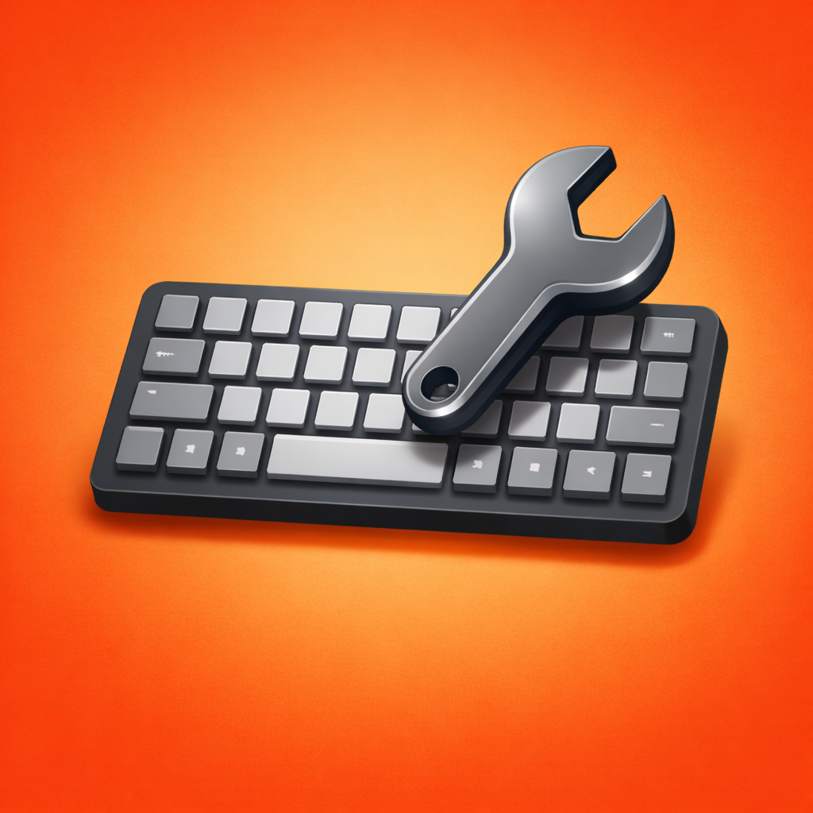

<p align="center">
  
</p>

<h1 align="center">Keyset</h1>

<p align="center">
  <strong>Profile-based keybind manager for Minecraft.</strong><br />
  Save layouts, swap instantly, and fix conflicts without losing context.
</p>

<p align="center">
  <a href="https://github.com/BeeBoyD/Keyset/releases"></a>
  <a href="https://modrinth.com/mod/keyset"></a>
  <a href="https://legacy.curseforge.com/minecraft/mc-mods/keyset"></a>
  <a href="LICENSE"></a>
  <a href="https://github.com/BeeBoyD/Keyset"></a>
  <a href="https://github.com/BeeBoyD/Keyset/releases"></a>
</p>

<p align="center">
  <a href="https://modrinth.com/mod/keyset">Modrinth</a> ·
  <a href="https://legacy.curseforge.com/minecraft/mc-mods/keyset">CurseForge</a> ·
  <a href="https://github.com/BeeBoyD/Keyset/releases">GitHub Releases</a> ·
  <a href="CHANGELOG.md">Changelog</a>
</p>

---

## ✨ Why Keyset

Keyset gives you named keybind profiles so you can move between PvP, building, tech, modpack, or general-play layouts without rebuilding your controls every time.

It is built for players who want:

- Fast profile switching with a clean in-game workflow
- Conflict cleanup with enough detail to make confident decisions
- Safe bulk fixing when a pack adds too many overlapping binds
- A local, profile-based setup that stays out of your way once configured

> **Release line note:** `1.3.x` targets Minecraft `1.20.1+`. Older `1.16.5-1.19.4` builds are on the `1.0.x` line and receive critical fixes only. Profile format compatibility is stable across the supported release line.

---

## 🚀 Highlights

- Multiple named profiles with instant switching
- Starter profiles: `Default`, `PvP`, `Building`, `Tech`
- Reorder, duplicate, rename, and delete profiles
- Import and export profile JSON through the clipboard
- Active profile persists across restarts
- Missing or temporarily unavailable keybind IDs are preserved
- Conflict browser with search by name, category, key, or internal ID
- Group conflicts by assigned key or by category
- Direct actions for a selected conflict
- Safe Fix with preview, apply, undo, and protected vanilla binds
- Deterministic output for the same input
- Slot hotkeys `1`-`5`, cycle next/prev, and open-screen hotkey

---

## 🧭 Quick Start

1. Open Minecraft's `Controls` screen and click `Keyset`.
2. Pick an existing profile or create one from your live controls.
3. Click `Save Live` to capture the current layout into the selected profile.
4. Search conflicts by action, key, category, or internal ID.
5. Use direct actions for one bind, or open `Safe Fix` for a guided cleanup pass.
6. Export profiles as JSON for backup or sharing.

---

## 📦 Supported Versions

Current `1.3.x` release line:

| Minecraft      | Fabric | Quilt | Forge | NeoForge |
| -------------- | ------ | ----- | ----- | -------- |
| 1.20.1-1.20.2  | ✅     | ✅    | ✅    | ✅       |
| 1.20.3-1.20.4  | ✅     | ✅    | ✅    | ✅       |
| 1.20.5-1.20.6  | ✅     | ✅    | ✅    | ✅       |
| 1.21.1         | ✅     | ✅    | ✅    | ✅       |
| 1.21.2-1.21.4  | ✅     | ✅    | ❌    | ✅       |
| 1.21.5-1.21.11 | ✅     | ✅    | ❌    | ✅       |
| 26.1           | ✅     | ✅    | ❌    | ✅       |

Legacy maintenance line:

- `1.0.x` remains available for `1.16.5-1.19.4`
- Legacy builds receive critical-fix-only maintenance
- Profile compatibility remains stable across the supported release family

Additional notes:

- Forge support is intentionally capped at `1.21.1`
- Quilt uses the Fabric-compatible jars

---

## ⬇️ Downloads

- [Modrinth](https://modrinth.com/mod/keyset)
- [CurseForge](https://legacy.curseforge.com/minecraft/mc-mods/keyset)
- [GitHub Releases](https://github.com/BeeBoyD/Keyset/releases)

Jar naming follows `loader + MC range + version`, for example:

- `keyset-fabric-1.21.1-1.3.0.jar`
- `keyset-forge-1.21.1-1.3.0.jar`
- `keyset-neoforge-1.21.5-1.21.11-1.3.0.jar`

---

## 🛠️ Building

```sh
./gradlew build
./gradlew verifyActiveWorkspace
```

Builds require Java 25+. Gradle toolchains handle lower target runtimes automatically.

---

## 🔒 Privacy

Keyset does not collect analytics, send telemetry, or upload your keybind data anywhere.

Profile data is stored locally in:

```text
config/keybindprofiles.json
```

---

## 📦 Modpack Notes

- Client-side only
- Safe to include in packs
- Does not add gameplay content
- Designed to stay additive and avoid fighting other keybind mods

---

## 💬 Support

If Keyset has been useful to you, consider [supporting development](https://www.buymeacoffee.com/beeboyd).
